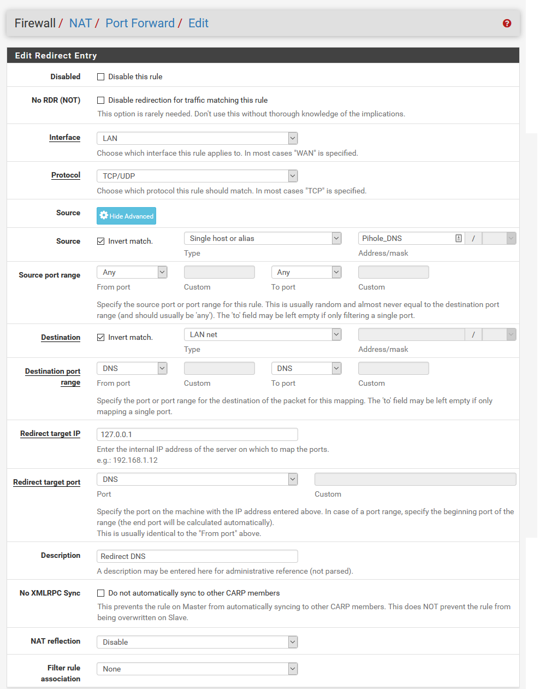
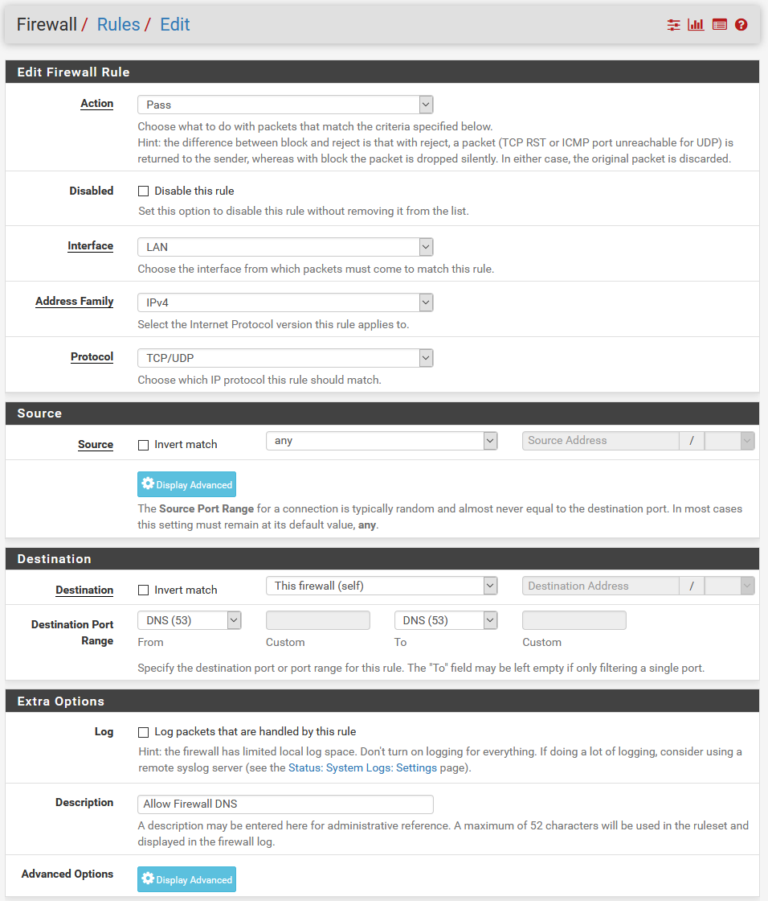

# Netgate-SG-3100 (Complete)

## Configuration Setting for Netgate SG-3100

## **Services / DNS Resolver / General**

---

### Services / DNS Resolver / General Settings

#### *Items Modified From Default -.*

    1. Network Interfaces = All
    2. Outgoing Network Interfaces = All
    3. System Domain Local Zone Type = Refuse
    4. DNS Query Forwarding = Checked
    5. DHCP Registration = Checked
    6. Static DHCP = Checked

---

### Firewall / NAT / Port Forward

 *Click Add to begin.*

#### *Items Modified From Default -..*

    1. Interface = LAN
    2. Protocol = TCP/UDP
    3. Source = (Invert = Checked) Single Host or Alias (Pihole_Dns)
        # Sorce is not Pihole DNS
    4. Destination = (Invert = Checked) LAN net
        # Destination is not LAN
    5. Destination port range = DNS (53)
    6. Redirect target = 127.0.0.1
    7. Redirect target port = DNS (53)
    8.. Description =  Redirect DNS
    9. NAT reflection = Disabled

---

### Firewall / Rules / LAN / Block DNS Catchall

 *Click Add to begin.*

#### *Items Modified From Default -...*

    1. Action = Block
    2. Interface = LAN
    3. Address Family = IPv4
    4. Protocol = TCP/UDP
    5. Source = Any
    6. Destination = Any
    7. Destination Port Range = DNS (53)
    8. Description = Block DNS Catchall
    9. Log = Checked

---

### Firewall / Rules / LAN / Permit OpenDNS

 *Click Add to begin.*

#### *Items Modified From Default -...*

    1. Action = Pass
    2. Interface = LAN
    3. Address Family = IPv4
    4. Protocol = TCP/UDP
    5. Source = Single host or alias (Alias = Pihole_Dns)
    6. Destination = Single host or alias (Alias = Open_Dns)
    7. Destination Port Range = DNS (53)
    8. Description = Permit OpenDNS

---

### Firewall / Rules / LAN / Allow Firewall DNS

 *Click Add to begin.*

#### *Items Modified From Default -...'*

    1. Action = Pass
    2. Interface = LAN
    3. Address Family = IPv4
    4. Protocol = TCP/UDP
    5. Source = Any
    6. Destination = This Firewall (self)
    7. Destination Port Range = DNS (53)
    8. Description = Allow Firewall DNS

---

#### *Final WAN Firewall Configuration.*

---

## [Return](../README.md)

 *For Bench Lab Only.*
 *For Production.*
