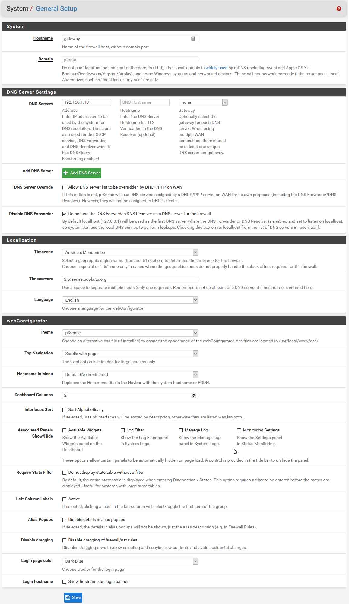

# Netgate-SG-3100 (Complete)

## Configuration Setting for Netgate SG-3100

## **System / General Setup**

---

### System / General Setup

#### *Items Modified From Default*

    1. Hostname = Gateway
    2. Domain = Workgroup
    3. DNS Server = [ Pihole Address(s) ]
    4. DNS Server Override = Unchecked
    5. Disable DNS Forwarder = Checked

---

## [Return](../README.md)
