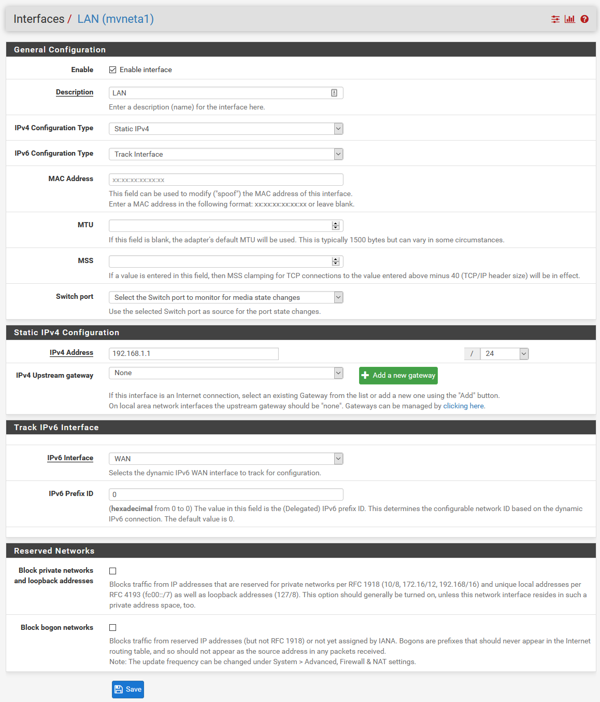
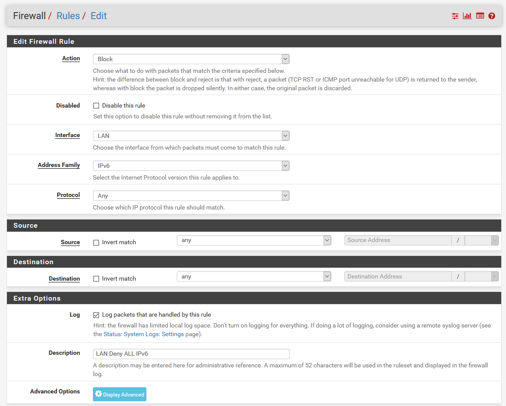

# Netgate-SG-3100 (In Progress)

## Configuration Setting for Netgate SG-3100

## **Firewall > Rules >  WAN**

---

### Interfaces > LAN 

#### *Items Modified From Default -.*

    1. IPv4 Address = 192.168.1.1

---

### Firewall > Rules > LAN > LAN Deny ALL IPv4 

 *Click Add to begin.*

#### *Items Modified From Default -..*

    1. Interface = LAN
    2. Address Family = IPv4
    3. Protocal = ANY
    4. Discription = LAN Deny ALL IPv4

This rule replaces the default DENY and allows us to log events.

---

### Firewall > Rules > LAN > LAN Deny ALL IPv6 

 *Click Add to begin.*

#### *Items Modified From Default -...*

    1. Interface = LAN
    2. Address Family = IPv6
    3. Protocal = ANY
    4. Discription = LAN Deny ALL IPv6

This rule replaces the default DENY and allows us to log events.

---

### Firewall > Rules > LAN > Default Allow LAN IPv4 

 *Click Add to begin.*

#### *Items Modified From Default -...*

    1. Interface = LAN
    2. Address Family = IPv4
    3. Protocal = ANY
    4. Source = LAN Net
    5. Destination = ANY
    6. Discription = Default Allow LAN IPv4

---

### Firewall > Rules > LAN > Default Allow LAN IPv6 

 *Click Add to begin.*

#### *Items Modified From Default -...*

    1. Interface = LAN
    2. Address Family = IPv6
    3. Protocal = ANY
    4. Source = LAN Net
    5. Destination = ANY
    6. Discription = Default Allow LAN IPv6

---

## [Return](../README.md)
