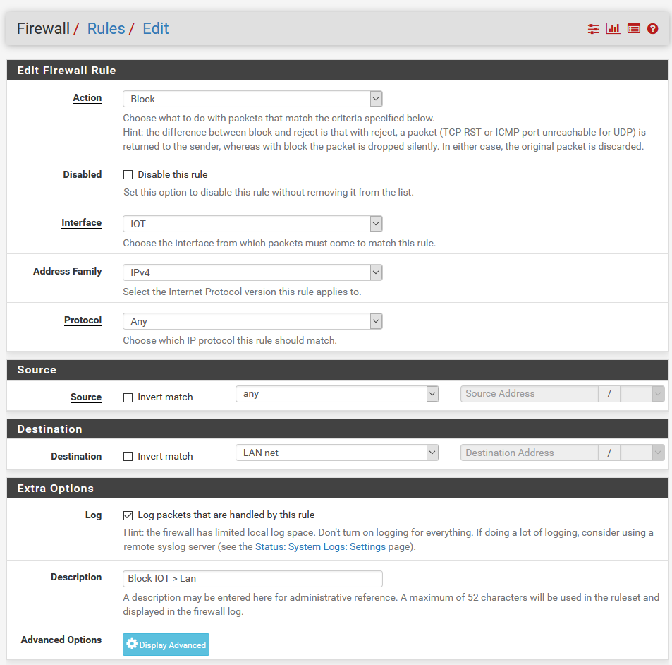
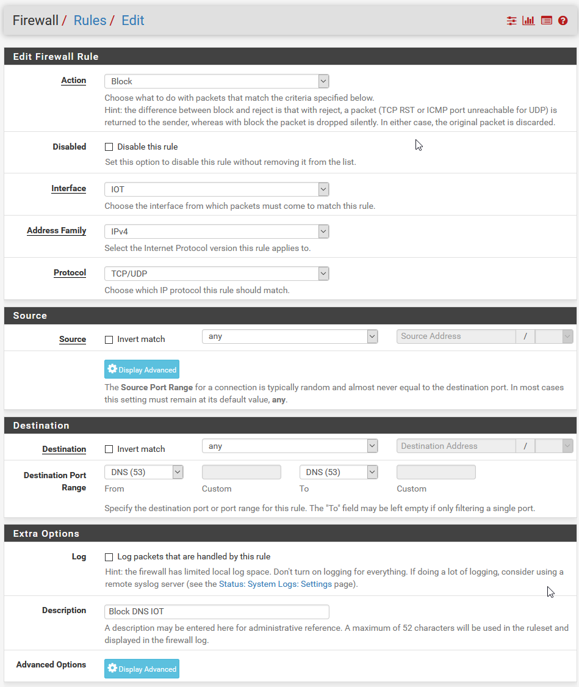

# Netgate-SG-3100 (Complete)

## Configuration Setting for Netgate SG-3100

## **Firewall / Rules**

---

### 

 *Click Add to begin.*

#### *Items Modified From Default -.*

    1. Action = Pass
    2. Interface = IOT
    3. Protocol = Any
    4. Source = IOT Net
    5. Description = Allow All IoT

---

### 

 *Click Add to begin.*

#### *Items Modified From Default -..*

    1. Action = Block
    2. Interface = IOT
    3. Protocol = Any
    4. Destination = LAN Net
    5. Description = Block IoT / Lan

---

### 

 *Click Add to begin.*

#### *Items Modified From Default -...*

    1. Action = Block
    2. Interface = IOT
    3. Protocol = TCP/UDP
    4. Destination Port Range = 53 
    5. Description = Block DNS IoT

---

### 

 *Click Add to begin.*

#### *Items Modified From Default -....*

    1. Action = Pass
    2. Interface = IOT
    3. Protocol = TCP/UDP
    4. Destination = IOT Net
    4. Destination Port Range = 53 
    5. Description = Allow DNS IoT

---

### 

---

##### All credit for VLANs to 'Lawrence Systems'

---

## [Return](../README.md)
