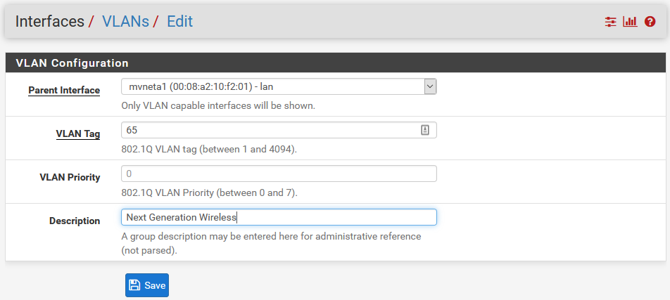
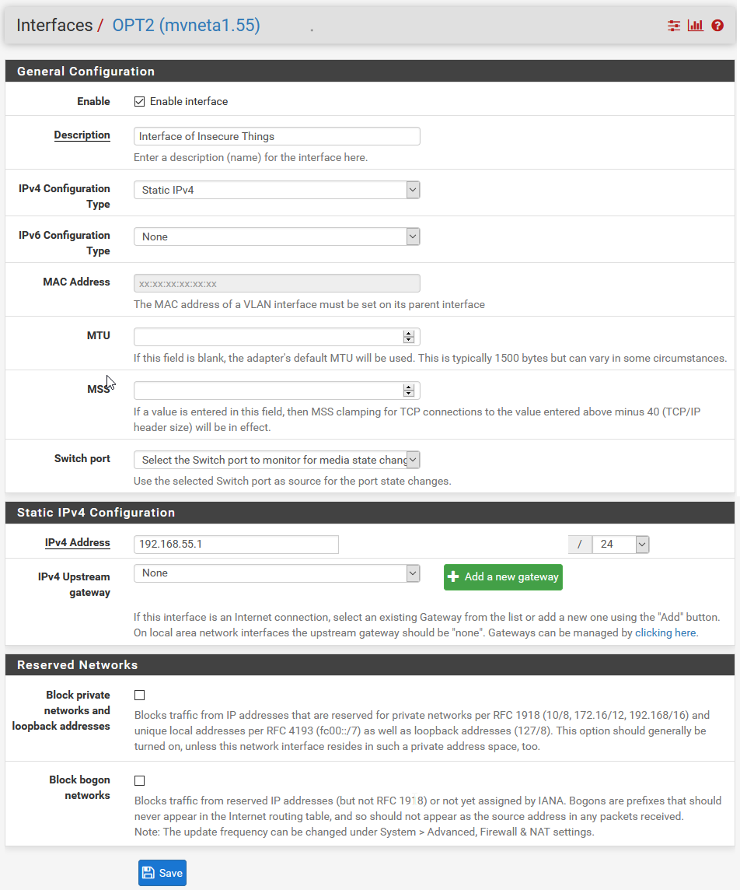
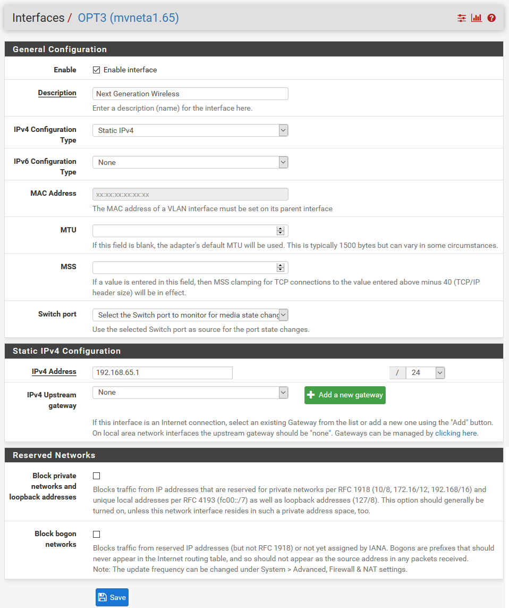
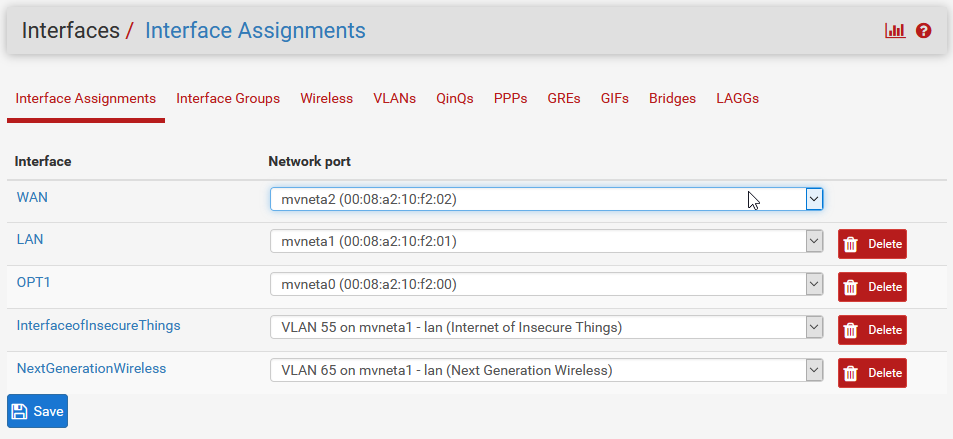

# Netgate-SG-3100 (Complete)

## Configuration Setting for Netgate SG-3100

## **Interfaces > VLANs**

---

## Interfaces > VLANs > VLAN Interfaces

 *Click Add to begin adding VLAN 55.*

### *Items Modified From Default*

    1. Parent Interface = Lan
    2. VLAN Tag = 55
    3. Description = Internet of Insecure Things.

---

 *Click Add to begin adding VLAN 65.*

### *Repeat for Vlan 65*

    1. Parent Interface = Lan
    2. VLAN Tag = 65
    3. Description = Next Generation Wireless.

---

### **Interfaces > Interface Assignments**

 `Use the Dropdown to modify`

#### *Items Modified From Default*

    1. Modify Interface Assignments > Interfaces OPT2 > Network Port = VLAN 55
    2. Modify Interface Assignments > Interfaces OPT3 > Network Port = VLAN 65

---

### **Interfaces > Interface Assignments > OPT2**

 `Click on OPT2 to being editing`

#### *Items Modified From Default*

    1. Enable = Checked
    2. Description = Interface of Insecure Things.
    3. IPv4 Address = 192.168.55.1

---

### **Interfaces > Interface Assignments > OPT3**

 `Click on OPT3 to being editing`

#### *Items Modified From Default*

    1. Enable = Checked
    2. Description = Next Generation Wireless.
    3. IPv4 Address = 192.168.65.1

---

#### *Final Interface Assignments Configuration.*

---

##### All credit for VLANs to 'Lawrence Systems'

---

# [Return](../README.md)