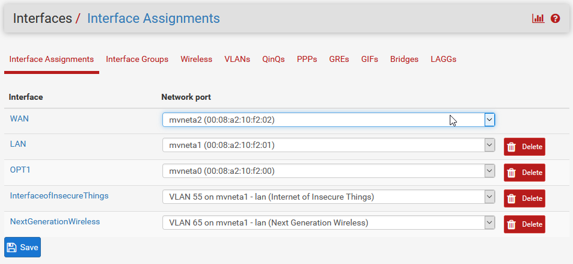
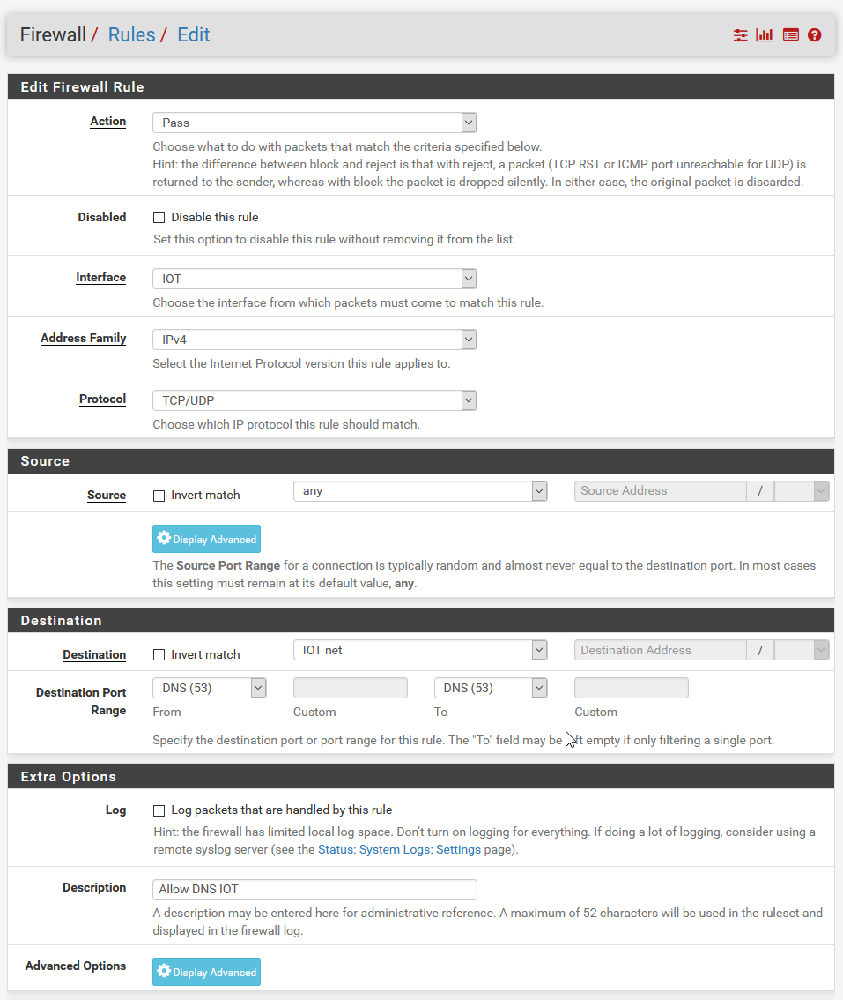
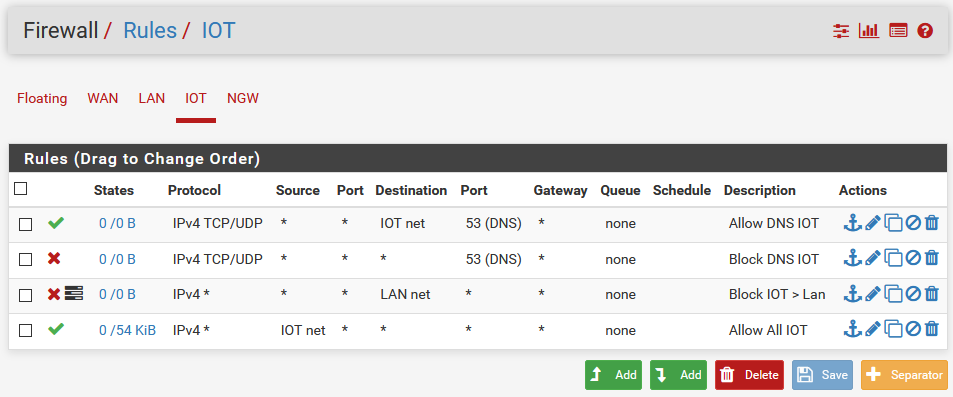

# Netgate-SG-3100

## Configuration Setting for Netgate SG-3100

### **Interfaces > VLANs**

#### *Items Modified From Default*

    1. Parent Interface = Lan
    2. VLAN Tag = 55
    3. Description = Internet of Insecure Things.

#### *Repeat for Vlan 65*

    1. Parent Interface = Lan
    2. VLAN Tag = 65
    3. Description = Next Generation Wireless.

---

### **Interfaces > Interface Assignments**

#### *Items Modified From Default*

    1. Modify Interface Assignments > Interfaces OPT2 > Network Port = VLAN 55
    2. Modify Interface Assignments > Interfaces OPT3 > Network Port = VLAN 65

### **Interfaces > Interface Assignments > OPT2**

#### *Items Modified From Default*

    1. Enable = Checked
    2. Description = Interface of Insecure Things.
    3. IPv4 Address = 192.168.55.1

### **Interfaces > Interface Assignments > OPT3**

#### *Items Modified From Default*

    1. Enable = Checked
    2. Description = Next Generation Wireless.
    3. IPv4 Address = 192.168.65.1

#### *Final Interface Assignments Configuration.*

---

## Firewall > Rules

### **Rules > IOT/NGW Network > Allow All IoT**

#### *Items Modified From Default*
    1. Action = Pass
    2. Interface = IOT
    3. Protocol = Any
    4. Source = IOT Net
    5. Description = Allow All IoT

### **Rules > IOT/NGW Network > Block IoT to LAN**

#### *Items Modified From Default*
    1. Action = Block
    2. Interface = IOT
    3. Protocol = Any
    4. Destination = LAN Net
    5. Description = Block IoT > Lan

### **Rules > IOT/NGW Network > Block External DNS**

#### *Items Modified From Default*
    1. Action = Block
    2. Interface = IOT
    3. Protocol = TCP/UDP
    4. Destination Port Range = 53 
    5. Description = Block DNS IoT

### **Rules > IOT/NGW Network > Allow PFSense DNS**

#### *Items Modified From Default*
    1. Action = Pass
    2. Interface = IOT
    3. Protocol = TCP/UDP
    4. Destination = IOT Net
    4. Destination Port Range = 53 
    5. Description = Allow DNS IoT

### **Rules > IOT/NGW Network > Final Configuration**

---

##### All credit for VLANs to 'Lawrence Systems'

# [Return](../README.md)
