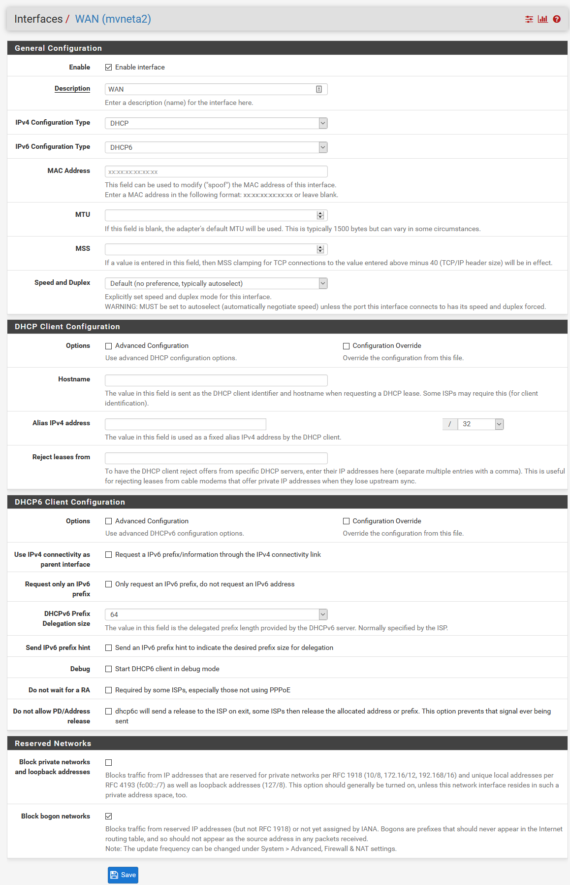
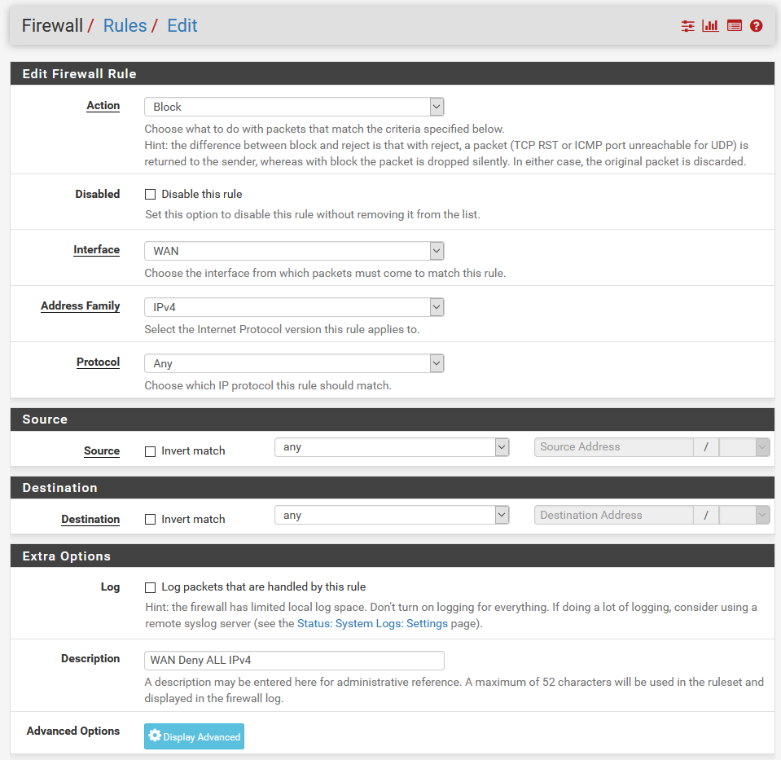
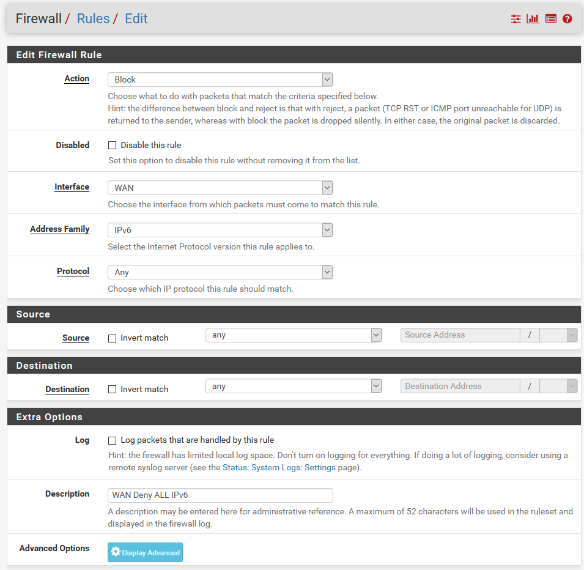
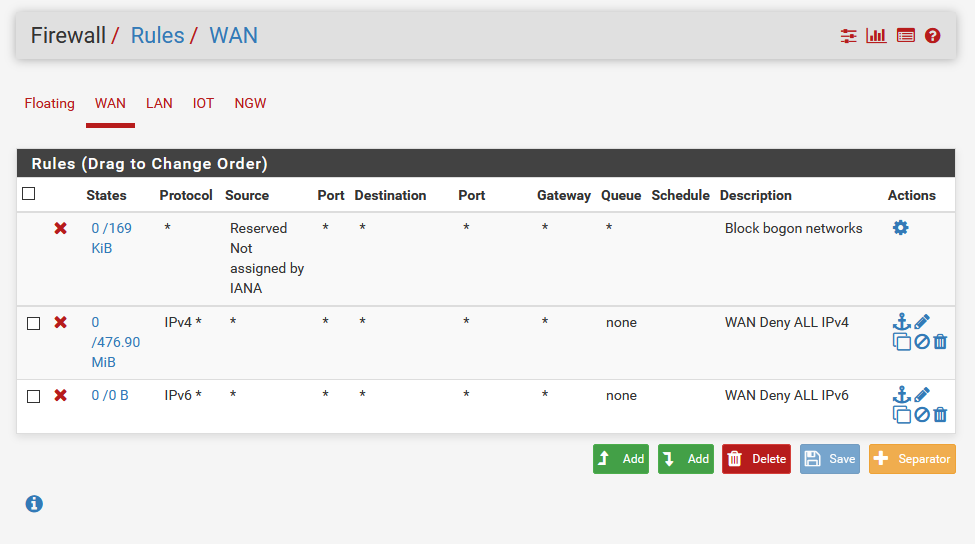

# Netgate-SG-3100 (Complete)

## Configuration Setting for Netgate SG-3100

## **Firewall > Rules >  WAN**

---

### Interfaces > WAN 

 *For Bench Lab Only.*

#### *Items Modified From Default -.*
    1. Block private networks and loopback addresses = Unchecked

 *For Production.*

#### *Items Modified From Default -..*

    1. Block private networks and loopback addresses = Checked

---

###  Firewall > Rules > WAN > WAN Deny ALL IPv4

 *Click Add to begin.*

#### *Items Modified From Default -...*

    1. Action = Block
    2. Interface = WAN
    3. Protocol = Any
    4. Source = Any
    5. Destination = Any
    6. Description = WAN Deny ALL IPv4

This rule replaces the default DENY and allows us to log events.

### Firewall > Rules > WAN > WAN Deny ALL IPv6

 *Click Add to begin.*

#### *Items Modified From Default -....*

    1. Action = Block
    2. Interface = WAN
    3. Protocol = Any
    4. Address Family = IPv6
    5. Source = Any
    6. Destination = Any
    7. Description = WAN Deny ALL IPv6

This rule replaces the default DENY and allows us to log events.

---

#### *Final WAN Firewall Configuration.*

---

## [Return](../README.md)
